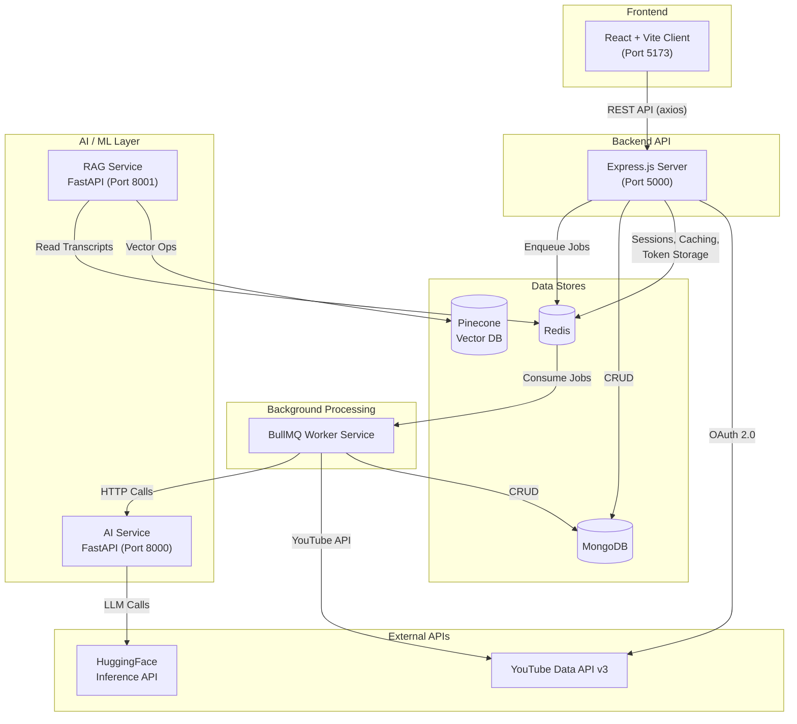
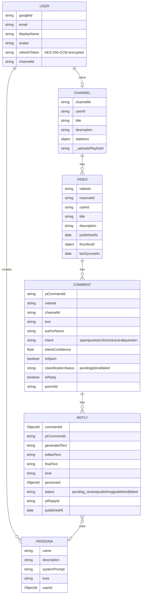
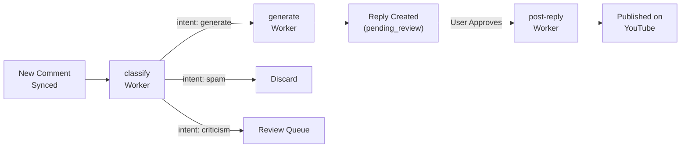
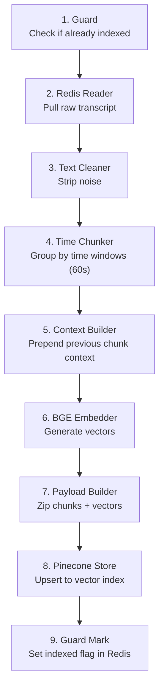
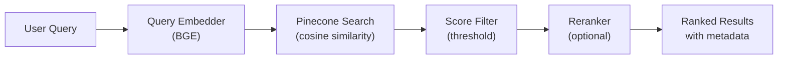
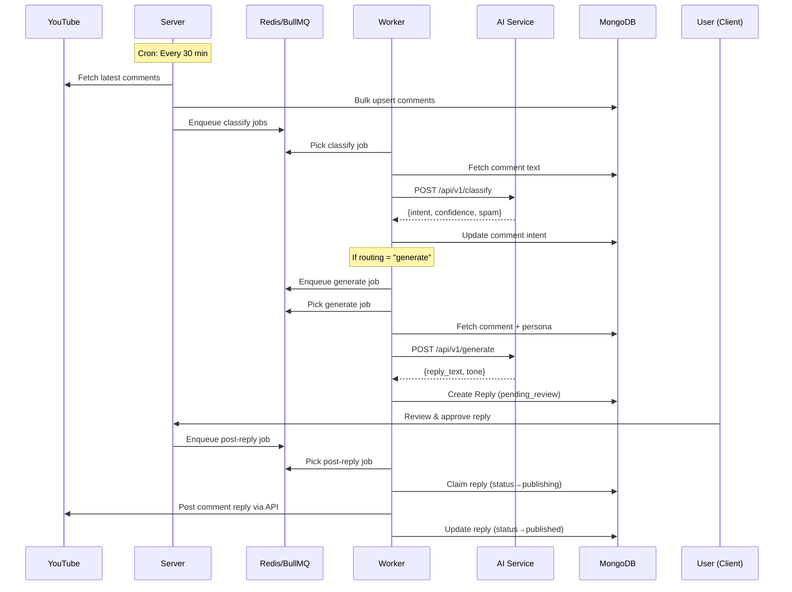
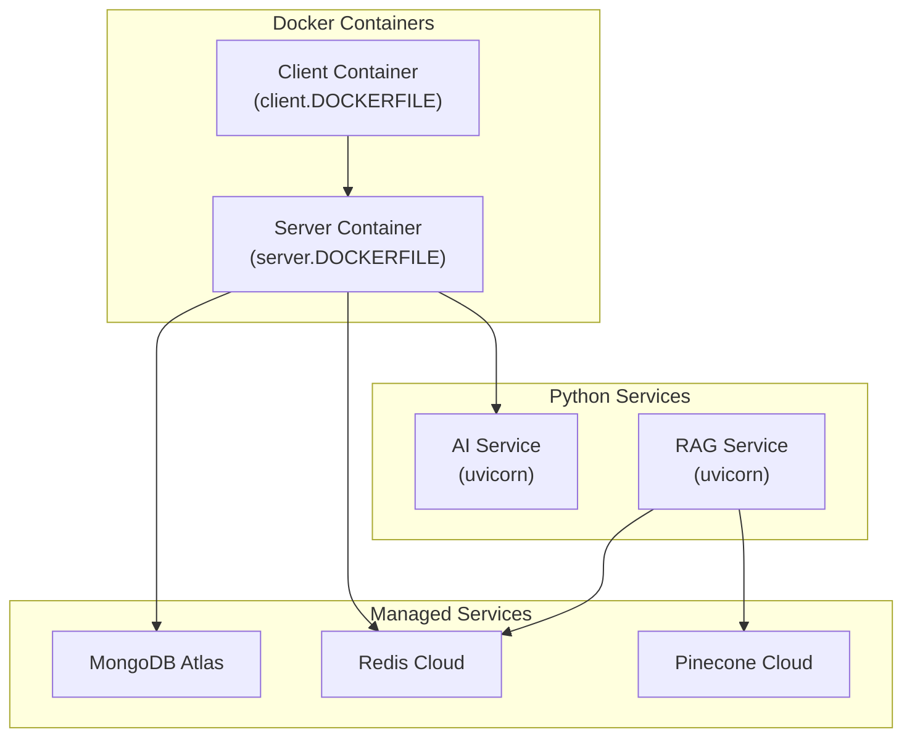

# ReplyPilot — System Architecture

## 1. Project Overview

**ReplyPilot** is an AI-powered YouTube comment management platform that automates comment classification, reply generation, and publishing. It uses a **microservices architecture** with 5 independent services communicating via REST APIs and Redis-backed message queues.

---

## 2. High-Level Architecture Diagram



---

## 3. Service Breakdown

### 3.1 Client — React + Vite Frontend

| Aspect | Detail |
|--------|--------|
| **Framework** | React 18 + Vite |
| **Routing** | React Router v6 with `ProtectedRoute` guard |
| **State** | `AuthContext` for auth state, `useAuth` hook |
| **API Layer** | Axios with base config (`api/axios.js`) |

#### Pages

| Page | Route | Purpose |
|------|-------|---------|
| `LandingPage` | `/` | Public marketing/login page |
| `DashboardPage` | `/dashboard` | Channel overview & analytics |
| `VideosPage` | `/videos` | List all synced videos |
| `VideoDetailPage` | `/videos/:videoId` | Video details + comments |
| `RepliesPage` | `/replies` | Manage AI-generated replies |
| `PersonasPage` | `/personas` | Create/manage reply personas |

#### API Modules
`channel.js`, `comments.js`, `replies.js`, `personas.js` — mapped to server REST endpoints.

---

### 3.2 Server — Express.js Backend API

| Aspect | Detail |
|--------|--------|
| **Framework** | Express.js (ES Modules) |
| **Port** | 5000 |
| **Auth** | Google OAuth 2.0 via Passport.js |
| **Sessions** | Redis-backed (`connect-redis`) with 7-day TTL |
| **Security** | Helmet, CORS, CSRF protection, rate limiting |
| **Logging** | Winston logger |

#### Architecture Pattern: MVC + Service Layer

```
Routes → Controllers → Services → Models (MongoDB)
                          ↓
                    Queue Service (BullMQ)
```

#### API Routes

| Route Prefix | Resource | Key Operations |
|-------------|----------|----------------|
| `/api/auth` | Authentication | Google OAuth login/callback, session, CSRF token |
| `/api/channel` | Channel | Sync channel info, fetch videos, fetch comments |
| `/api/comments` | Comments | List/filter comments, classification status |
| `/api/personas` | Personas | CRUD for reply persona profiles |
| `/api/batch` | Batch Ops | Bulk classify/generate for multiple comments |
| `/api/replies` | Replies | List, approve, edit, post replies |
| `/health` | Health Check | Service status |

#### Middleware Stack

| Middleware | Purpose |
|-----------|---------|
| `auth.middleware.js` | Session-based authentication check |
| `csrf.middleware.js` | CSRF token validation |
| `rateLimiter.middleware.js` | API rate limiting (Redis-backed) |
| `youtubeToken.middleware.js` | Injects valid YouTube access token into `req` |
| `requestLogger.middleware.js` | HTTP request logging |
| `error.middleware.js` | Global error handler |

#### Data Models (MongoDB / Mongoose)



#### Key Services

| Service | Responsibility |
|---------|---------------|
| `Channel.service.js` | Sync channel, videos, comments from YouTube API; bulk upsert to MongoDB |
| `queue.service.js` | BullMQ queue initialization (classify, generate, post-reply); enqueue helpers |
| `replyService.js` | HTTP calls to AI Service for reply generation |
| `aiService.js` | HTTP calls to AI Service for intent classification |

#### Background Jobs

| Job | Schedule | Purpose |
|-----|----------|---------|
| `syncComments.job.js` | Every 30 min (cron) | Fetches latest comments for all videos across all channels |

#### Security Features

- **Token Encryption**: Google refresh tokens encrypted at rest with AES-256-GCM (`utils/crypto.js`)
- **User Caching**: Redis cache for deserialized user (15-min TTL, avoids DB hit per request)
- **YouTube Token Management**: Access tokens cached in Redis (55-min TTL), auto-refresh via refresh token (`youtubeToken.helper.js`)
- **Session Regeneration**: On OAuth callback
- **Graceful Shutdown**: SIGTERM/SIGINT handlers for server, cron, DB

---

### 3.3 Worker — BullMQ Background Job Processor

| Aspect | Detail |
|--------|--------|
| **Queue System** | BullMQ on Redis |
| **Concurrency** | 5 per worker |
| **Retry Policy** | 3 attempts, exponential backoff (5s base) |
| **Separate Process** | Runs independently from API server |

#### Worker Pipeline



#### Workers Detail

| Worker | Queue Name | What It Does |
|--------|-----------|--------------|
| `classify.worker.js` | `classify` | Fetches comment → calls AI `/api/v1/classify` → updates intent, spam status |
| `generate.worker.js` | `generate` | Fetches comment + persona → calls AI `/api/v1/generate` → creates `Reply` doc |
| `postReply.worker.js` | `post-reply` | Claims reply → gets YouTube token → posts via YouTube API → marks published |
| `youtubeSync.worker.js` | `youtube-sync-queue` | Syncs latest videos (24h) + caches transcripts in Redis |

#### Scheduler

| Component | Purpose |
|-----------|---------|
| `scheduler.js` | BullMQ repeatable job — runs daily at midnight, dispatches `youtube-sync` jobs for all users |

#### Post-Reply Idempotency
- Atomic claim via `findOneAndUpdate` with status guard
- YouTube reply ID checkpointed immediately after post
- `replyCountCredited` flag prevents double-counting on retries

---

### 3.4 AI Service — FastAPI (Python)

| Aspect | Detail |
|--------|--------|
| **Framework** | FastAPI |
| **Port** | 8000 |
| **Endpoints** | `/api/v1/classify`, `/api/v1/generate` |

#### Intent Classification

| Component | Detail |
|-----------|--------|
| **Model** | Custom fine-tuned HuggingFace `transformers` pipeline |
| **Model Location** | Local `model_files/` directory |
| **Training** | `intent_classifier_training.ipynb` (included in repo) |
| **Intents** | `spam`, `praise`, `criticism`, `neutral`, `question` |
| **Routing Logic** | spam → discard, criticism → review, others → generate |

#### Reply Generation

| Component | Detail |
|-----------|--------|
| **LLM** | Google Gemma-4-31B-it (via HuggingFace Inference API) |
| **API** | `AsyncOpenAI` client pointing to `router.huggingface.co/v1` |
| **Prompt System** | Template-based with base system prompt + tone-specific instructions |
| **Temperature** | 0.7, max 250 tokens |

#### Supported Tones (10 Prompt Templates)

| Tone | File |
|------|------|
| Friendly | `tone_friendly.txt` |
| Professional | `tone_professional.txt` |
| Humorous | `tone_humorous.txt` |
| Neutral | `tone_neutral.txt` |
| Informative | `tone_informative.txt` |
| Appreciative | `tone_appreciative.txt` |
| Apologetic | `tone_apologetic.txt` |
| Supportive | `tone_supportive.txt` |
| Promotional | `tone_promotional.txt` |

---

### 3.5 RAG Service — FastAPI (Python)

| Aspect | Detail |
|--------|--------|
| **Framework** | FastAPI |
| **Port** | 8001 |
| **Purpose** | Video transcript indexing + semantic search for context-aware replies |
| **Endpoints** | `/api/v1/ingest`, `/api/v1/query`, `/health` |

#### Ingest Pipeline (9 Stages)



#### Retrieval Pipeline



| Component | File | Purpose |
|-----------|------|---------|
| `query_embedder.py` | Retrieval | Embeds user questions using BGE model |
| `searcher.py` | Retrieval | Pinecone vector search with score filtering |
| `reranker.py` | Retrieval | Cross-encoder reranking for precision |
| `IngestOrchestrator` | Pipeline | Master controller for all 9 ingest stages |

---

## 4. Technology Stack Summary

| Layer | Technologies |
|-------|-------------|
| **Frontend** | React 18, Vite, React Router v6, Axios |
| **Backend API** | Node.js, Express.js, Passport.js |
| **Background Jobs** | BullMQ (Redis-backed) |
| **AI / NLP** | Python, FastAPI, HuggingFace Transformers, OpenAI SDK |
| **LLM** | Google Gemma-4-31B-it (HuggingFace Inference) |
| **Embeddings** | BGE (BAAI General Embedding) |
| **Vector DB** | Pinecone |
| **Primary DB** | MongoDB (Mongoose ODM) |
| **Cache / Queue** | Redis |
| **Auth** | Google OAuth 2.0, Passport.js, Sessions |
| **Security** | Helmet, CORS, CSRF, AES-256-GCM encryption, Rate Limiting |
| **External API** | YouTube Data API v3 |
| **Infra** | Docker (Dockerfiles for client + server) |
| **Logging** | Winston (Node.js), structlog (Python) |

---

## 5. Data Flow — End-to-End Comment Reply Pipeline



---

## 6. Deployment Architecture



---

## 7. Folder Structure

```
ReplyPilot/
├── client/                          # React Frontend
│   ├── src/
│   │   ├── api/                     # Axios API modules
│   │   ├── components/              # ProtectedRoute
│   │   ├── context/                 # AuthContext
│   │   ├── hooks/                   # useAuth
│   │   ├── layouts/                 # AppLayout
│   │   ├── pages/                   # 6 page components
│   │   ├── App.jsx                  # Router setup
│   │   └── main.jsx                 # Entry point
│   └── vite.config.js
│
├── server/                          # Express.js Backend
│   ├── server.js                    # Entry point + graceful shutdown
│   └── src/
│       ├── config/                  # env, db, redis, passport, cors
│       ├── controllers/             # 5 controllers
│       ├── middleware/              # 6 middleware
│       ├── models/                  # 6 Mongoose models
│       ├── routes/                  # 7 route files
│       ├── services/                # Channel, Queue, Reply, AI
│       ├── mapper/                  # Channel, Video, Comment mappers
│       ├── jobs/                    # syncComments cron job
│       ├── utils/                   # crypto, logger, youtube helpers
│       └── app.js                   # Express app setup
│
├── worker/                          # BullMQ Worker Service
│   ├── main.js                      # Entry + shutdown
│   ├── config/                      # db, redis, env
│   ├── models/                      # Mongoose models (shared schema)
│   ├── tasks/
│   │   ├── classify.worker.js       # Intent classification worker
│   │   ├── generate.worker.js       # Reply generation worker
│   │   ├── postReply.worker.js      # YouTube posting worker
│   │   ├── youtubeSync.worker.js    # Video sync worker
│   │   ├── scheduler.js             # Daily dispatch scheduler
│   │   └── index.js                 # Worker registry
│   └── utils/                       # httpClient, logger, youtube helpers
│
├── ai-service/                      # Python AI Microservice
│   └── app/
│       ├── main.py                  # FastAPI app
│       ├── api/v1/                  # classify & generate routes
│       ├── services/                # classify_service, generate
│       ├── models/                  # Intent classifier training notebook
│       ├── model_files/             # Fine-tuned classification model
│       ├── prompts/                 # 10 tone template files
│       ├── schemas/                 # Pydantic request/response models
│       └── core/                    # logging config
│
├── rag/                             # Python RAG Microservice
│   └── app/
│       ├── main.py                  # FastAPI app
│       ├── api/routes/              # health, ingest, query routes
│       ├── services/                # ingest_service, query_service
│       ├── pipeline/
│       │   ├── orchestrator.py      # 9-stage ingest pipeline
│       │   ├── ingestion/           # guard, redis_reader, text_cleaner
│       │   ├── chunking/            # token_splitter, context_builder
│       │   ├── embedding/           # bge_embedder, batch_manager
│       │   └── storage/             # payload_builder, pinecone_client
│       ├── retrieval/               # query_embedder, searcher, reranker
│       └── core/                    # config, logger, exceptions
│
└── infra/
    └── docker/
        ├── client.DOCKERFILE
        └── server.DOCKERFILE
```

---

## 8. Key Design Decisions

| Decision | Rationale |
|----------|-----------|
| **Separate Worker Process** | Isolates CPU-heavy AI calls from API latency; scales independently |
| **BullMQ over direct HTTP** | Retry with exponential backoff, job persistence, concurrency control |
| **Custom Classifier + LLM** | Fine-tuned classifier for fast intent detection; Gemma-4-31B for quality generation |
| **RAG for Video Context** | Transcript-aware replies using semantic search over video content |
| **Redis for Multiple Roles** | Sessions, caching, token store, job queue — single Redis instance |
| **Idempotent Post-Reply** | Atomic claim + checkpoint pattern prevents duplicate YouTube posts |
| **Encrypted Refresh Tokens** | AES-256-GCM encryption at rest for Google OAuth tokens |
| **Template-Based Prompts** | 10 tone files allow easy customization without code changes |
